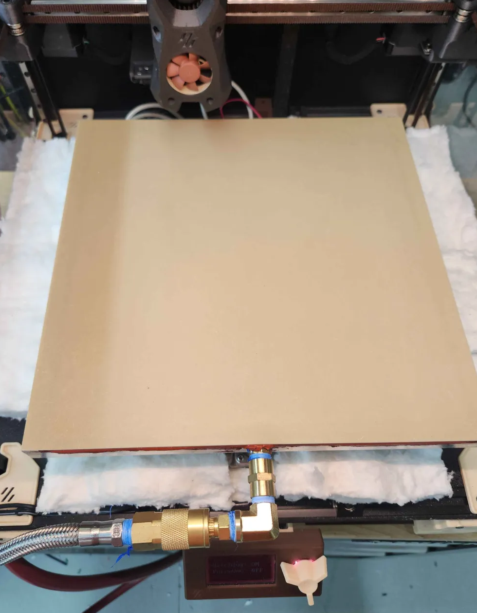

# Open loop Vacuum System For Klipper
This system is designed as a more affordable alternative to my belt printer closed-loop vacuum systems and can be used in any printer. It requires a vacuum pump and a motorized valve. The system operates without any sensors to read the vacuum level or a tank to adjust the vacuum level as needed. If you need a more advanced system, please refer to my closed-loop vacuum system for Klipper. Tested and validated on my Voron V2.4.



# System Requirements

* [Motorized Valve](https://www.amazon.com/Motorized-Valve-Stainless-U-S-Solid/dp/B06XXPZHVB/ref=sr_1_3?sr=8-3)
* [H bridge motor driver](https://www.amazon.com/HiLetgo-BTS7960-Driver-Arduino-Current/dp/B00WSN98DC/ref=sr_1_6?sr=8-6)
* [AC or DC VACAUUM PUMP](https://www.amazon.com/VIVOHOME-Single-Rotary-Vacuum-Bottle/dp/B07RGQ786R/ref=sr_1_3_sspa?sr=8-3-spons&sp_csd=d2lkZ2V0TmFtZT1zcF9hdGY&psc=1)
* [Vacuum BED](https://discord.gg/tRkB7DqXUE) and contact me
* AC or DC RELAY to control the vacuum pump

### CODE TODOs
* Improve gcode commands
* Prioritize watchdog timer
# Configure  "printer.cfg"
add the module name
``` bash 
# Configuration for Blind Vacuum System
[blind_vacuum myvacuum]
# Pin configuration for the vacuum pump relay
vacuum_pump_pin: P0.10  # Digital pin for the vacuum pump relay control

# Pin configuration for the valve operations
# These are the PWM pins coming from the H bridge driver. Its going to be either 1 or 0, we don't need to slow down openning or closing so no PWM needed!
valve_open_pin: P1.25   # PWM pin for opening the valve
valve_close_pin: P1.27  # PWM pin for closing the valve

# Watchdog timer for the vacuum system
vacuum_timer: 172800    # Watchdog timer in seconds. With good seals, -20 inHg should be maintained for at least 2 days. (System default is 600 seconds)

# Optional configuration parameters (uncomment and set if needed)
# pump_on_time: 2       # Amount of time required to create rough vacuum. Default is 8 seconds due to valve operations. (Typically takes 1-2 seconds)
# valve_close_time: 3   # Time taken by motorized valves to close. Default is 6 seconds. (In my case, it's 3 seconds)

# Additional notes:
# - Ensure proper pin configuration matching your hardware setup. Motorized Valves need H bridge to run both directions!
# - Adjust the timer settings based on your specific system behavior. Ideally, you don't want to go below -13 inHg. Since there is no vacuum sensor, perform a manual test as follows:
#   	1. Start a timer and observe when the vacuum bed no longer effectively holds the build plate.
#   	2. Use half of this observed time as the vacuum timer (watchdog timer) setting.
```
# Built-in Gcode commands
Starts the Watchdog timer, turns on the pump, and adds delays for valve operation based on timing parameters defined in the configuration.
``` bash 
    ENABLE_VACUUM
```

Stops the vacuum system and unregisters the Watchdog timer, ensuring all operations are safely terminated.
``` bash 
    DISABLE_VACUUM
```

Forces the pump to turn on and the valve to open, bypassing the Watchdog timer. Use this command to manually control the system when automatic control is not needed.
``` bash 
    FORCE_VACUUM_ON
```

Forces the pump to turn off and the valve to close, bypassing the Watchdog timer. Use this command to manually stop the system immediately.
``` bash 
    FORCE_VACUUM_OFF
```

Forces the pump to turn on, bypassing the Watchdog timer. Use this command to manually activate the pump only.
``` bash 
    FORCE_PUMP_ON
```

Forces the pump to turn off, bypassing the Watchdog timer. Use this command to manually deactivate the pump only.
``` bash 
    FORCE_PUMP_OFF
```

Forces the valve to open, bypassing the Watchdog timer. Use this command to manually open the valve only.
``` bash 
    FORCE_VALVE_OPEN
```

Forces the valve to close, bypassing the Watchdog timer. Use this command to manually close the valve only.
``` bash 
    FORCE_VALVE_CLOSE
```


# Example config for MENU
```
[menu __main __vacuum]
type: list
name: Vacuum
index: 1

[menu __main __vacuum __vacsystem]
type: input
name: Watchdog: {'ON ' if menu.input else 'OFF'}
input: {printer["blind_vacuum myvacuum"].watchdog}
input_min: 0
input_max: 1
input_step: 1
gcode:
    
      ENABLE_VACUUM
    
      DISABLE_VACUUM
    

[menu __main __vacuum __forcevac]
type: input
name: ForceVAC: {'ON ' if menu.input else 'OFF'}
input: {printer["blind_vacuum myvacuum"].is_forced_vacuum}
input_min: 0
input_max: 1
input_step: 1
gcode:
    
      FORCE_VACUUM_ON
    
      FORCE_VACUUM_OFF
    
```


